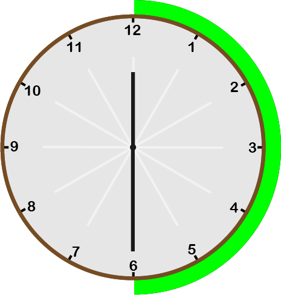
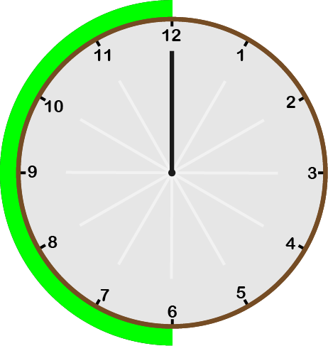

# 🎓 Learn end spoken english

## 📌 What's the time now ? (શું સમય થયો ?)

#### 🔺 Simple Time (`00:00`)

- જ્યારે મિનિટ 00 હોય ત્યારે.

| Time    | Conversation    |
| ------- | --------------- |
| `12:00` | It's 12 O'clock |
| `01:00` | It's 1 O'clock  |
| `03:00` | It's 3 O'clock  |
| `09:00` | It's 9 O'clock  |
| `11:00` | It's 11 O'clock |

****
****
****

#### 🔺 How to pronounce half minutes (`00:30`).

- જ્યારે અડધો કલાક થયો ત્યારે અને જ્યારે મિનિટ કાંટો 30 પર હોય ત્યારે.

| Time    | Conversation      |
| ------- | ----------------- |
| `12:30` | It's half past 12 |
| `01:30` | It's half past 1  |
| `03:30` | It's half past 3  |
| `09:30` | It's half past 9  |
| `11:30` | It's half past 11 |

****
****
****

#### 🔺 `00:01` to `00:29` min using `past` pronunciation.

- 01 થી 29 મિનિટ થયેલ હોય ત્યારે (`past`) લાગસે.



****
****
****

It's `Minutes` past `Hours`

| Time    | Conversation    |
| ------- | --------------- |
| `12:10` | It's 10 past 12 |
| `01:14` | It's 14 past 1  |
| `06:24` | It's 24 past 6  |
| `11:25` | It's 25 past 11 |

****
****
****

#### 🔺 Quarter past (`00:15`)

- જ્યારે 15 મિનિટ થયેલ હોય ત્યારે (`Quarter`) લાગસે.

| Time    | Conversation         |
| ------- | -------------------- |
| `12:15` | It's quarter past 12 |
| `01:15` | It's quarter past 1  |
| `06:15` | It's quarter past 6  |
| `11:15` | It's quarter past 11 |

****
****
****

#### 🔺 `00:31` to `00:59` min using `to` pronunciation.



****
****
****

It's `Minutes` to `Hours`

- Now time is `12:35`. 
- 60 minutes less 35 minutes = 25 minutes
- And increase one hours
- **`It's 25 to 1` (12:35)**

| Time    | Conversation  |
| ------- | ------------- |
| `12:31` | It's 29 to 1  |
| `02:35` | It's 25 to 3  |
| `06:51` | It's 9 to 7   |
| `11:43` | It's 17 to 12 |

****
****
****

#### 🔺 Quarter to (`00:45`)

| Time    | Conversation       |
| ------- | ------------------ |
| `12:45` | It's quarter to 1  |
| `01:45` | It's quarter to 2  |
| `06:45` | It's quarter to 7  |
| `11:45` | It's quarter to 12 |

## 📌 `wish`, `want`, `desire`, `fancy` And `action`

`Wish` : **ઈચ્છા**

`Action` : **કર્તવ્ય**

| I Wish to Action |
| ---------------- |
| I wish to ""     |
| I want to ""     |
| I desire to ""   |
| I fancy to ""    |

#### 🔺 વાક્ય રચના (Sentences)

- મારે જવું છે. 

```
I want to go.
```

****

- મારી જવાની ઈચ્છા છે.

```
I wish to go.
```

****

- મારે નાચવું છે.

```
I want to dance.
```

****

- મારી નાચવા ની ઈચ્છા છે.

```
I wish to dance.
```

****

- હું અંગ્રેજી સીખવા માંગુ છું. 

```
I desire to learn english.
```

****

- હું તમને કઈક કેવા માંગુ છું.

```
I fancy to say you something.
```

## 📌 Present (વર્તમાનકાળ)

#### 🔺 Vowel (`સ્વર`) and Consonants (`વ્યંજન`)

અંગ્રેજીમાં `સ્વર` (`Vowel`) 5 નીચે મુજબ હોય છે. અને 5 સવારો સિવાય ના બધા જ Alphabet વ્યંજનો (`Consonants`) હોય છે.

**Vowel (`સ્વર`)**
```
a, e, i, o, u
```

જ્યારે વર્તમાનકાળ મા `He` અને `She` નો ઉપયોગ થાય ત્યારે `સ્વર` (`Vowel`) અને `વ્યંજન` (`Consonants`) નો ઉપયોગ કરીને (`s`, `es`, `ies`) લગાડવું પડસે.

****
****
****

- જ્યારે કોઈ વાક્ય ની પાછડ **(`a`, `e`, `i`, `o`, `s`)** હોય ત્યારે એ વાક્ય ની પાછડ **(`S`)** લાગસે.


*Ex* : પેલાને આઈફોને ખરીદવાની ઈચ્છા છે.

```
He desires to buy iPhone.
```

*Ex* : પેલીને apple અને banana ખાવા ભાવે છે.

```
She like to eat apples and bananas.
```

*Ex* : મારા મમ્મી તને તારા જન્મ દિવસ ની સુભકામના આપે છે.

```
My mom desires to wish you happy birthday.
```

****
****
****

- જ્યારે કોઈ વાક્ય ની પાછડ **(`ss`, `ch`, `sh`, `x`, `o`)** હોય ત્યારે એ વાક્ય ની પાછડ **(`es`)** લાગસે.

*Ex* : goes, does, sixes

*Ex* : પેલીની આઈફોને ખરીદવાની ઈચ્છા છે.

```
She wishes to buy iPhone.
```

*Ex* : મારા મિત્ર ની ઈચ્છા છે અંગ્રેજી સીખવાની.

```
My Friend wishes to learn english.
```

****
****
****

- જ્યારે કોઈ વાક્ય ની પાછડ (`y`) ની પહેલા વ્યંજન (`Consonant`) હોય ત્યારે (`y`) નિકડી ને (**`ies`**) લગાડવા મા આવસે.

- તેની ઈચ્છા છે ટોપી ખરીદવા ની. 

```
She fancies to buy cap.
```

- મારા પપ્પા ની ઈચ્છા છે ટિકિટ બૂક કરવાની. 
  
```
My father fancies to get ticket book.
```
